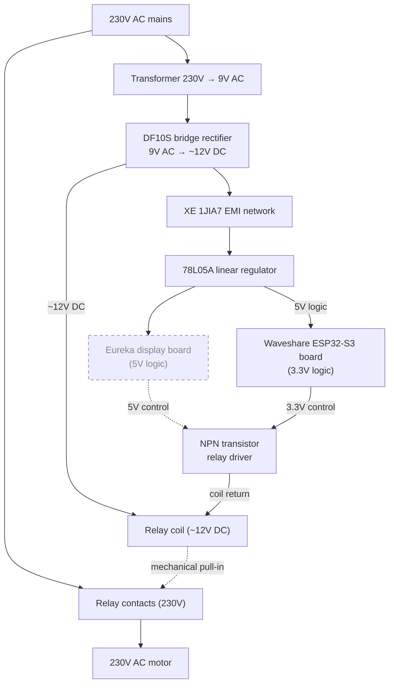

# Eureka Mignon Specialita Power Board

Factual notes from a teardown of the stock Specialita control board. This page only documents the original grinder electronics and wiring conventions observed.

## Power & Control Topology

## Observed Power Path

- 230 V mains enters the rear panel, feeds the relay common contact, and energizes the transformer primary in parallel.
- The transformer secondary delivers ~9 V AC to a DF10S full bridge, producing ~12 V DC for the low-voltage section.
- EMI network XE 1JIA7 filters the rectified rail before it reaches the 78L05A regulator.
- The regulator outputs 5 V for the factory display logic; headroom was measured as limited (<100 mA available).
- The motor feed includes an 8 µF start/run capacitor (Eureka part 1013.0008) rated 425/250/475 V at 50/60 Hz, wired between the motor terminals to provide the start/run phase shift; observed can size 30 mm × 60 mm with a longer 70 mm version also sold.

## Control & Relay Stage

- The display PCB sources a 5 V signal into an NPN transistor (Q1) that sinks the relay coil.
- Coil voltage is the unregulated ~12 V DC from the bridge; coil return traces directly to Q1’s collector.
- Relay contacts switch the full 230 V feed to the grinder motor with no intermediate speed control.

## Harness Reference

Four conductors exit the power board via a keyed plug. Colors refer to the inspected unit; note that the inverted colors (red = ground, black = +5 V) may only exist on this sample, so other grinders could differ.

| Wire Color | Function | Notes |
|------------|----------|-------|
| Red | Ground reference | Chassis-tied; inverted color may be unique to this unit |
| Black | +5 V regulated output | Supplies factory display |
| White | Relay control signal | Routed to Q1 base network |
| Gray | Front button signal | Momentary switch pulls Gray to Red (low-active) |

## Component Callouts

- Transformer marking: “230 V → 9 V AC” encapsulated block, mounted near mains inlet.
- Rectifier: DF10S (1 A, 1000 V) bridge package, bolted to PCB for thermal dissipation.
- EMI block: XE 1JIA7 two-terminal filter between bridge and regulator reservoir capacitor.
- Regulator: 78L05A TO-92 providing the 5 V logic rail.
- Relay: 12 V DC coil, four-pin footprint, switching the motor line.
- Button: Momentary switch wired between Gray (signal) and Red (ground) conductors, active low.
- Motor capacitor: 8 µF can (part 1013.0008), 425/250/475 V rating, 30 mm × 60 mm body (longer 70 mm variant also used).
